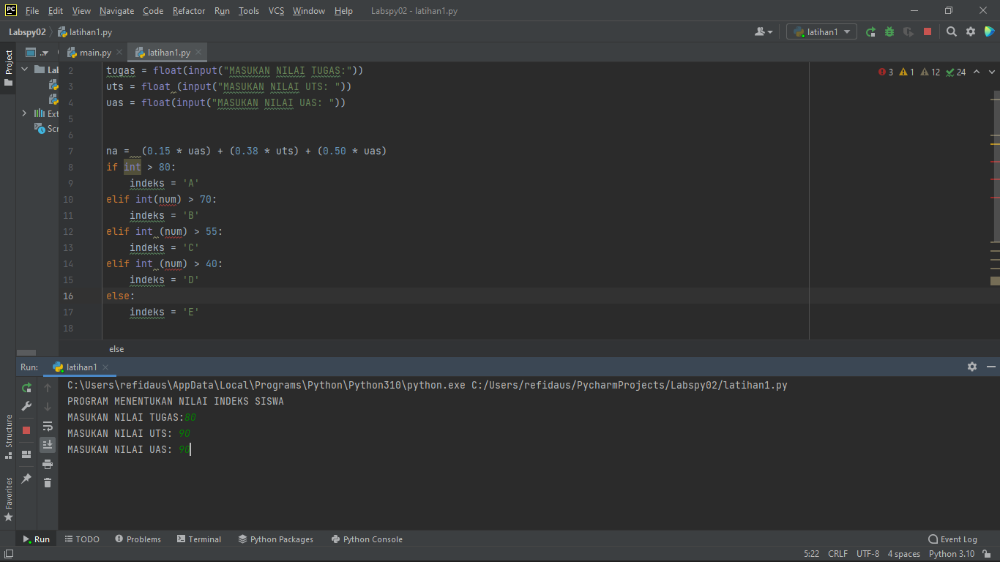
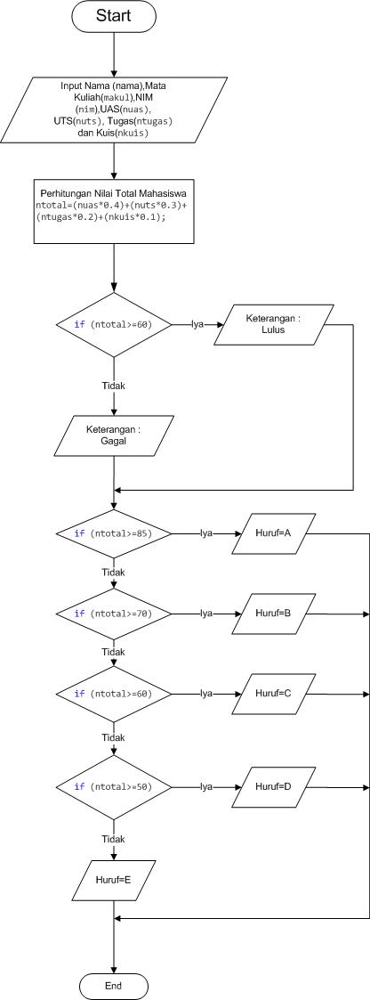

                                MEMBUAT PROGRAM SEDERHANA DENGAN INPUT 3 BUAH BILANGAN 

INI CODINGNYA

menggunakan percabangan IF dengan beberapa kondisi sesuai dengan aturan skala nilai indeks 

Nilai indeks mahasiswa di tentukan dari skor nilai akhir yang di peroleh mahasiswa lewat 3 komponen penilaian 
Nilai tugas sebesar 15% Nilai UTS sebesar 35% Nilai UAS sebesar 50% 

FLOWCHART 

